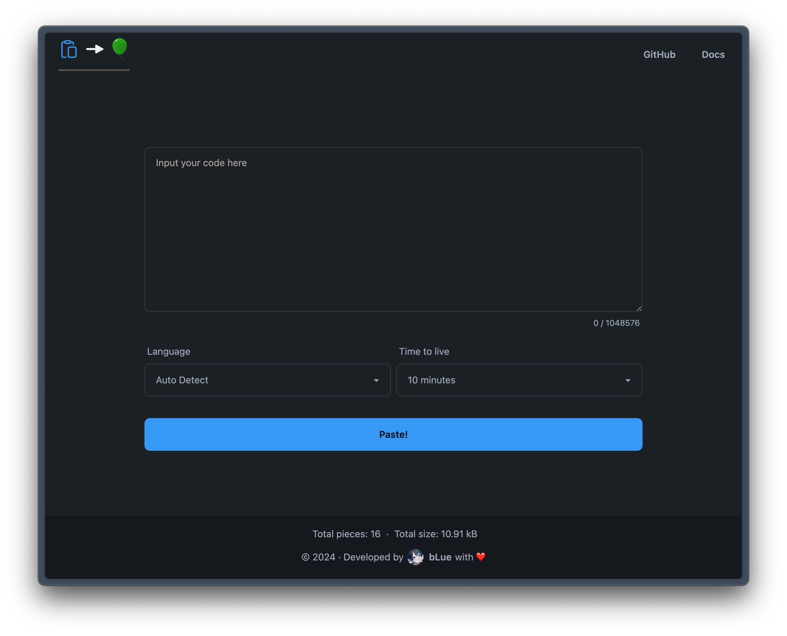
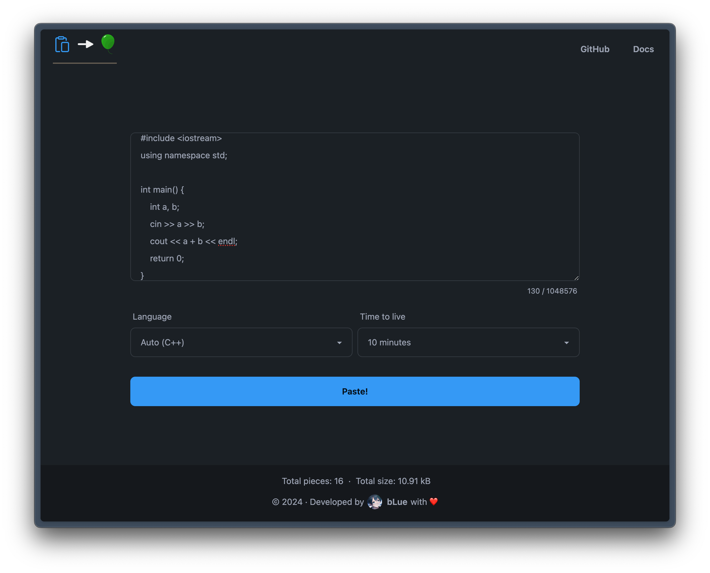
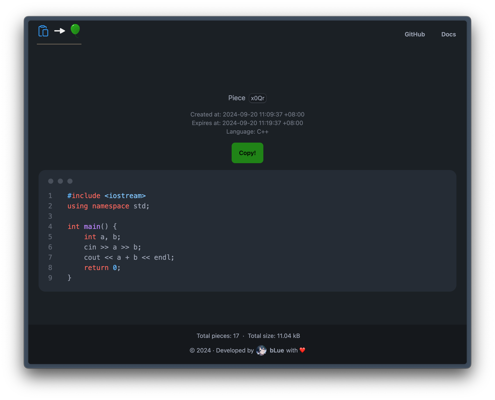

# 快速上手

欢迎来到 Paste then AC！这是一个超便捷粘贴与分享代码的工具。

## 粘贴！

Paste then AC 的界面十分简洁。

除代码外，你可以额外配置更多属性：

- `Language`：代码语言。默认自动侦测，如侦测不准确，你亦可手动选择语言
- `Time to live`：此代码片段的有效期。你可以控制它在多久后被销毁

填妥后，轻点 `Paste!` 按钮即可张贴这份伟大的代码。如无意外，你将获得一个随机生成的短链接，即刻复制并分享！

## 打开分享！

当打开一份分享的代码时，你可以快速浏览代码内容及其相关信息。

轻点 `Copy!` 按钮即可快速复制代码到剪贴板。
